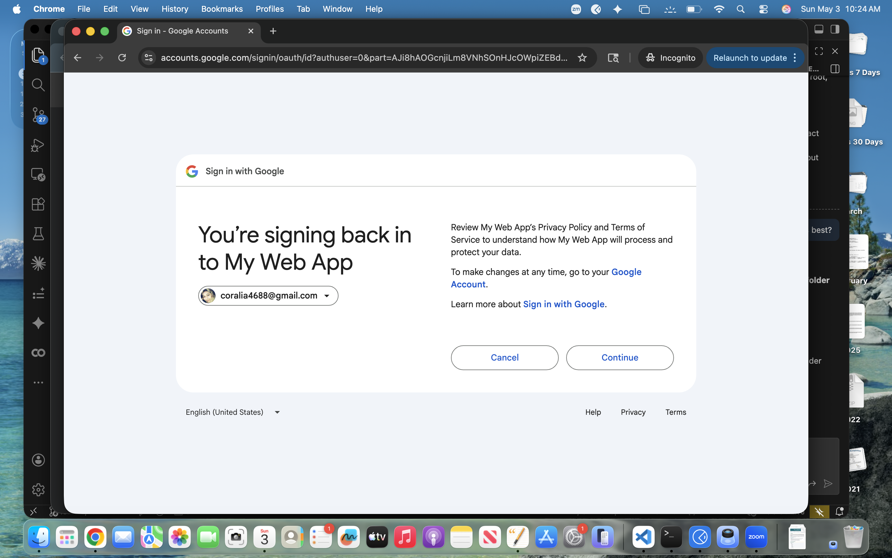
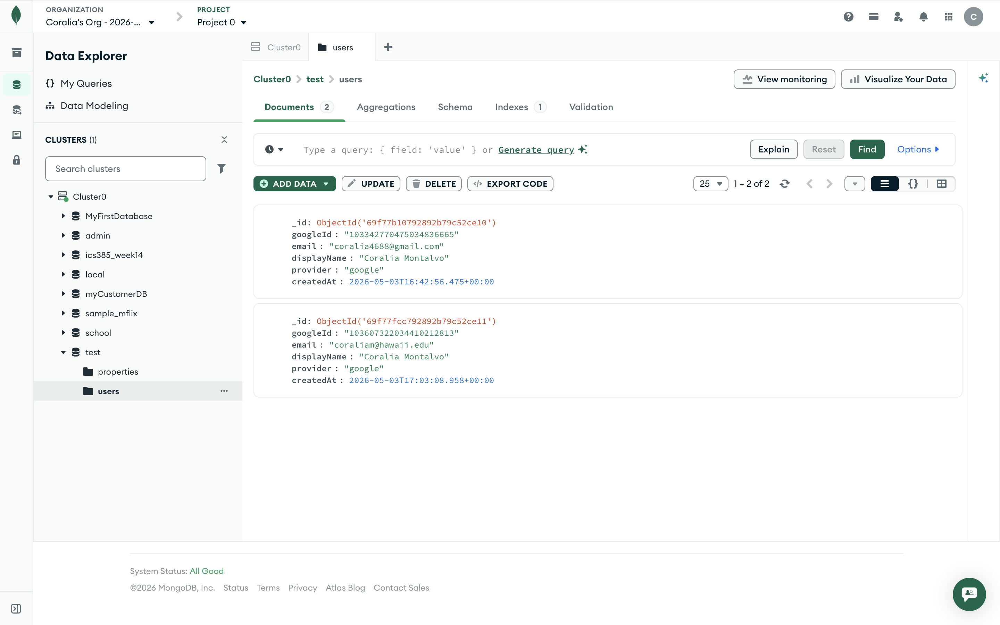

# HW15-A — Google OAuth 2.0 (Passport)

Minimal demo for HW15-A. Copy `.env.example` to `.env`, fill in your Google OAuth client credentials and MongoDB URI, and keep `.env` out of Git (it is already listed in `.gitignore`).

## Setup

From the `week15/hw15a` folder, install dependencies and start the app:

```bash
npm install
npm start
```

Open http://localhost:3000 and click "Sign in with Google".

## Required Environment Values
- `GOOGLE_CLIENT_ID`
- `GOOGLE_CLIENT_SECRET`
- `MONGO_URI`
- `SESSION_SECRET`

## Submission Check
- `GET /` shows the sign-in button.
- `GET /profile` is protected and shows the signed-in user.
- `POST /logout` clears the session.
- MongoDB stores a `users` document with Google account info.

## Screenshots

Put these files in `week15/hw15a/screenshots/` before submitting:

1. Google consent screen showing your application name
   - 
2. Successful `/profile` page showing your email and `_id`
   - 
3. MongoDB Compass or Atlas showing the inserted `users` document
   - 

## Reflection
Google OAuth simplified the authentication part of the application by letting me rely on Google’s identity system instead of building and securing my own username/password database. That removed the need to hash passwords, manage password resets, and handle much of the credential storage logic myself. It also made login more convenient for users because they can sign in with an account they already trust. At the same time, OAuth added new responsibilities: I had to configure the Google Cloud Console correctly, protect client secrets, manage sessions on the server, persist the federated user record in MongoDB, and make sure the callback route and profile route were secured properly. In other words, authentication became easier for the user, but the app still had to handle safe integration, state management, and data persistence.

## AI Tools Used
- GitHub Copilot: assisted with scaffolding, debugging, and documentation cleanup in `week15/hw15a`.
- No generated code was copied blindly; all files were reviewed and adjusted to match the assignment requirements.
